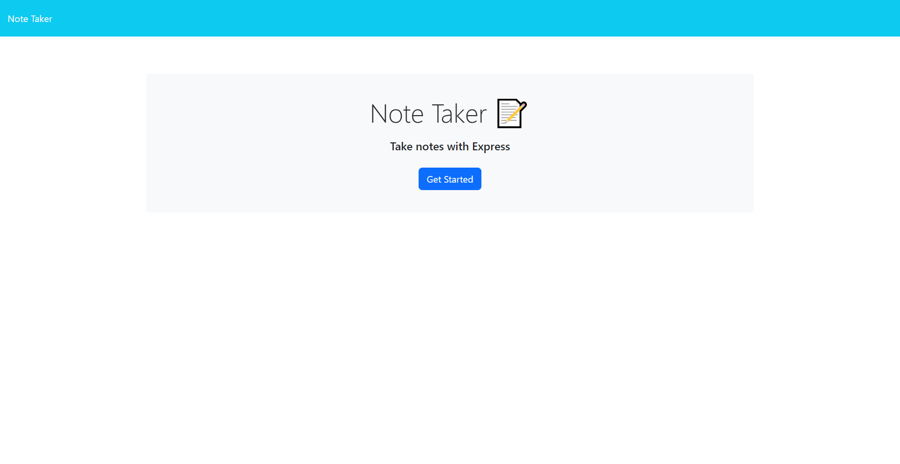
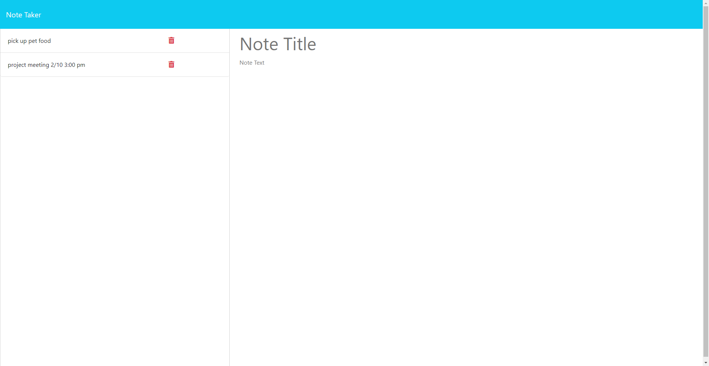

# Note-Taker

## Description
    
Note Taker makes it easy to take and keep track of notes. This application uses an Express.js back end to save and retrieve note data from a JSON file.

It can be difficult to keep track of important information in an organized manner. This note taker application helps users with that problem by providing a place to easily write notes, see the content of previously saved notes, and then remove notes when they are no longer needed.

Making the back-end of this application helped me become much more familiar with using express.js to host a server. I was able to learn how to use get, post, and delete requests to store new data in a JSON file, retrieve that data for viewing, and then remove select data.
    
## Table of Contents
    
- [Installation](#installation)
- [Usage](#usage)
- [Screenshots](#screenshots)
- [Contributing](#contributing)
- [License](#license)
- [Tests](#tests)
- [Questions](#questions)
    
## Installation

You can use the deployed application by entering the url https://note-taker-vtt5.onrender.com/ into your browser without any additional installation.

To run the server locally, install the latest version of NodeJS. Download this repo onto your local computer. Navigate to the file directory and run "npm i" to install the necessary packages.   
    
## Usage

To use the deployed version, enter https://note-taker-vtt5.onrender.com/ into your browser.

To run the server locally, download this repo onto your local computer and navigate to these files using your terminal. Run 'npm start' to start the server.
Open http://localhost:3001/ in your browser to see the home page. Click the "Get Started" button or navigate to http://localhost:3001/notes to start taking notes.

To use the note taker, enter text into the "Note Title" and "Note Text" fields, then click the "Save Note" button on the top right of the screen. While writing a note, click the "Clear Form" button to clear the contents of the title and text.
After saving, the title of your note will appear on the left side bar. Click the title to see the note content displayed.
To delete a note, click the red trash icon next to the note you want to delete.

### Screenshots

    
## Contributing

- Contributors: [eaeidsath](github.com/eaeidsath), [Xandromus](https://github.com/Xandromus), [nol166](https://github.com/nol166), [Georgeyoo](https://github.com/Georgeyoo)
- Credits: The fsUtils.js and clog.js files were pulled from bootcamp practice materials.
- Contribution instructions: This project is not seeking contributions at this time.
    
## License

The following license is being used for this project: MIT License.
    
## Tests

N/A

## Questions

Please direct questions to [eaeidsath](github.com/eaeidsath) or email your questions to evelyneidsath@gmail.com.